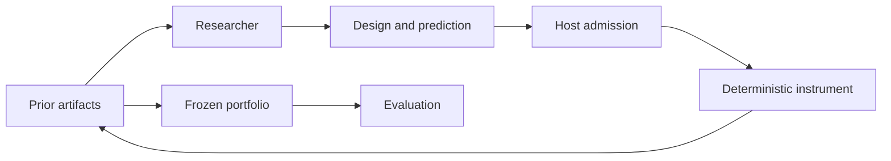

# algal-lab

Reproducible research environments built on [ALGAL](https://github.com/hraness/algal).

Researchers propose experiments, record predictions before measurement (the
ordering is enforced inside the local receipt; it is not an external
commitment), and build on prior artifacts within a study. The laboratory records
what was requested, what the instrument did, and which observations support each
result. Within a study, later rounds see up to 24 recent prior designs with
their discovery scores (graph, score, and evidence ID only) and, in one
condition, the last 12 short messages; hypotheses, rationales, predictions, and
trajectories are not shown to researchers, and nothing carries across studies.
Every competing design stays in the archive for inspection.

The first lab explores **network resilience**: which connected graph structures
preserve service as nodes fail? It compares isolated researchers, researchers
sharing artifacts, and researchers sharing artifacts plus messages. Every
condition gets the same number of proposal slots and paired failure schedules.

## Try it

Tested with [Bun 1.3.14](https://bun.sh) (CI-pinned; `engines` requires
`>=1.3.14`). No credentials or model calls are needed.

```sh
git clone https://github.com/hraness/algal-lab.git
cd algal-lab
bun install --frozen-lockfile
bun run demo
bun run lab verify runs/demo
```

The demo runs 54 proposal slots: two seeds × three conditions × three researchers
× three rounds. Open `runs/demo/report.md` for the comparison. `study.json` links
the content-addressed evidence, full ALGAL receipts, frozen portfolios, and
per-design evaluation trajectories.

The default researcher is a **deterministic search baseline**. It uses observed
graphs and measurements and ignores message prose; the two shared conditions
therefore produce the same numerical baseline. This demonstrates the research
and verification machinery, not an LLM discovery or a benefit from communication.

Each run requires a new output directory. To change the protocol or rerun:

```sh
bun run lab study --protocol examples/network-study.json --out runs/experiment-2
bun run lab verify runs/experiment-2
```

## The research loop



- **Predictions precede measurements.** A proposal includes a graph, hypothesis,
  numerical prediction, rationale, and references to visible earlier experiments.
- **Information sharing is controlled.** Each round uses a fixed snapshot;
  later participants cannot see results from earlier participants in that round.
- **Evaluation is separated.** All portfolios freeze before evaluation on
  held-out random schedules and a repeated targeted-failure control. No subsequent
  model calls or holdout-based admission occur in the study.
- **Evidence is inspectable.** Failed attempts and original proposals remain in
  receipt-bearing artifacts. Bounded structural rejections become recorded errors.
- **Verification is offline.** It reconstructs the protocol with recorded agent
  effects, executes the simulator afresh, and checks the resulting receipts,
  artifacts, and the `study.json` report object against the archive.
  `report.md` is generated text and is not verified. Verification never runs
  the original provider command.

The instrument measures the largest surviving connected component divided by the
original node count, across random and targeted node-removal trajectories. This
is a toy graph model. It does not simulate traffic, physical materials, or actual
infrastructure. Two demo seeds are not evidence of statistical superiority.

## Connect a model

Supply an explicitly chosen, trusted command wrapper. It receives one ALGAL
`EffectRequest` JSON on stdin; the lab context is at `context.inputs.context`.
It must return one proposal JSON on stdout. The wrapper owns provider credentials
and model settings; credentials must never appear in its response. The wrapper
must also be stateless across calls: each proposal must depend only on the
request it receives. A wrapper that keeps memory (a cache, a conversation, a
file) would leak information across conditions and across researchers within a
round's fixed snapshot, and the lab cannot detect that leak.

Exercise that wire protocol with the included credential-free example:

```sh
bun run lab study --protocol examples/network-study.json --out runs/command-demo \
  --executor-command 'bun examples/scripted-executor.ts'
bun run lab verify runs/command-demo
```

Replace the example with your provider wrapper to use an LLM. The example is still
scripted search. A study allows at most 288 proposal slots; each receives at most
one agent call, 120 seconds, 64 KiB of context, and 8 KiB of output. These are
execution limits, not a dollar-spend guarantee. A provider failure consumes its
slot and is recorded without an automatic retry. Partial runs are retained; this
version does not resume them.

See the [proposal contract](src/contracts.ts), [researcher manifest](src/researcher.ts),
and [security boundary](SECURITY.md) before connecting an executor.

## Qualify the approach

The [frozen qualification plan](docs/qualification-plan.md) separates numerical
correctness from search usefulness. Its independent oracle computes expected
random-failure AUC over every removed-node subset on graphs with at most ten
nodes. It evaluates the full failure distribution, including discovery states.
Each condition selects one champion from discovery results before evaluation;
targeted attack remains a separately reported control. Researcher requests omit
condition names, while the host archive retains assignment metadata.

```sh
bun run qualify:instrument
bun run qualify
bun run lab verify-qualification runs/qualification
```

The instrument check covers every connected labeled graph with 4–6 nodes,
comparing the simulator against an independent union-find connectivity
implementation under every targeted horizon and five random schedules each.
It checks that random removals are valid and numerically consistent; the random
schedule's PRNG sequence itself is not independently derived. `bun run
qualify:instrument` finishes in a few seconds and writes
`runs/instrument-qualification.json`; that file is never overwritten, so pass a
new path to `bun scripts/qualify-instrument.ts <file>` for another run, or omit
the path to print the evidence to stdout.

The qualification runs three graph regimes and 16 search seeds against
equal-opportunity random search, preserving all paired differences and checking
that the scripted controls ignore message prose. Expect roughly 20–40 s for
`bun run qualify` and about half a minute for `verify-qualification` on a
recent laptop; `bun run check` takes one to two minutes on an idle machine and
longer when other work is running.
Read `runs/qualification/report.md`. Qualification needs a fresh directory;
use `bun run lab qualify --plan examples/qualification-plan.json --out runs/qualification-2`
for another run. A null sharing result is a valid outcome.

The replicated comparison is the next, frozen step:

```sh
bun run compare
bun run lab verify-comparison runs/comparison
```

`compare` runs the [frozen comparison plan](docs/comparison-plan.md)
(`examples/comparison-plan.json`):
the scripted control arms `adaptive` and `random`, an optional live arm when
`--executor-command` is supplied, and paired inference over replicate seeds
against a preregistered margin. `verify-comparison` reconstructs every arm's
studies offline and recomputes the whole analysis. Without a live arm the result
is a scripted control run, not model evidence.

The random-search policy is also available for individual studies:

```sh
bun run lab study --protocol examples/network-study.json --out runs/random --policy random
```

The optional [XCB example](examples/xcb-study.ts) uses qualified, ephemeral,
tool-free application inference and retains readable transport metadata. It
requires an independently admitted local provider; the default workflows never
make model calls. See [live executor qualification](docs/live-executor.md).

The [Gateway example](examples/gateway-study.ts) instead reuses ALGAL's built-in
Vercel AI Gateway executor. It requires explicit model/provider selection and
authorized Gateway credentials, retains token usage when reported, and uses the
same twelve-slot smoke acceptance. See [Gateway inference](docs/gateway-executor.md)
and its [frozen transport plan](docs/gateway-smoke-plan.md).
Two live smokes are recorded. The [first](docs/gateway-smoke-findings.md)
failed its predeclared acceptance: all twelve generations completed, but one
proposal exceeded the edge budget and remains retained as a failed slot. After
the [exact-budget v2 proposal contract](docs/proposal-contract-v2-plan.md) was
frozen, the [second smoke](docs/gateway-smoke-v2-findings.md) measured 12/12
proposals and passed. Neither smoke shows a sharing benefit: every condition
selected the same champion graph in both runs.

## Scope and development

ALGAL supplies typed execution and receipts. Algal Lab owns experimental
protocols, instruments, artifact retention, and interpretation. The dependency
is pinned to an exact public ALGAL source commit; this repository is distributed
as source, with no hosted service or npm publication required.

```sh
bun run check
```

Tests cover analytical graph cases, malformed proposals, information-sharing
boundaries, the command executor, archive tampering, offline reproduction, and
the maximum admitted study. Contribute through a checked pull request.

- [Research method](docs/research-method.md): measurements, controls, budgets, and limits.
- [Architecture](docs/architecture.md): ALGAL integration and the evidence model.
- [Roadmap and research sources](docs/roadmap.md): hypothesis testing, reusable
  discoveries, and later instrument evolution. Valhalla integration is deferred.
- [Contributing](CONTRIBUTING.md).
