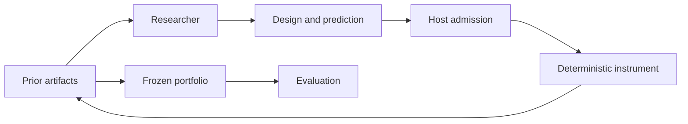

# algal-lab

Reproducible research environments built on [ALGAL](https://github.com/hraness/algal).

Researchers propose experiments, commit predictions before measurement, and build
on persistent artifacts. The laboratory records what was requested, what the
instrument did, and which observations support each result. Competing designs
remain available for later researchers.

The first lab explores **network resilience**: which connected graph structures
preserve service as nodes fail? It compares isolated researchers, researchers
sharing artifacts, and researchers sharing artifacts plus messages. Every
condition gets the same number of proposal slots and paired failure schedules.

## Try it

Requires [Bun 1.3.14](https://bun.sh). No credentials or model calls are needed.

```sh
git clone https://github.com/hraness/algal-lab.git
cd algal-lab
bun install --frozen-lockfile
bun run demo
bun run lab verify runs/demo
```

The demo runs 54 proposal slots: two seeds × three conditions × three researchers
× three rounds. Open `runs/demo/report.md` for the comparison. `study.json` links
the content-addressed evidence, full ALGAL receipts, frozen portfolios, and
per-design evaluation trajectories.

The default researcher is a **deterministic search baseline**. It uses observed
graphs and measurements and ignores message prose; the two shared conditions
therefore produce the same numerical baseline. This demonstrates the research
and verification machinery, not an LLM discovery or a benefit from communication.

Each run requires a new output directory. To change the protocol or rerun:

```sh
bun run lab study --protocol examples/network-study.json --out runs/experiment-2
bun run lab verify runs/experiment-2
```

## The research loop



- **Predictions precede measurements.** A proposal includes a graph, hypothesis,
  numerical prediction, rationale, and references to visible earlier experiments.
- **Information sharing is controlled.** Each round uses a fixed snapshot;
  later participants cannot see results from earlier participants in that round.
- **Evaluation is separated.** All portfolios freeze before evaluation on
  held-out random schedules and a repeated targeted-failure control. No subsequent
  model calls or holdout-based admission occur in the study.
- **Evidence is inspectable.** Failed attempts and original proposals remain in
  receipt-bearing artifacts. Bounded structural rejections become recorded errors.
- **Verification is offline.** It reconstructs the protocol with recorded agent
  effects, executes the simulator afresh, and checks the resulting receipts,
  artifacts, and report. It never runs the original provider command.

The instrument measures the largest surviving connected component divided by the
original node count, across random and targeted node-removal trajectories. This
is a toy graph model. It does not simulate traffic, physical materials, or actual
infrastructure. Two demo seeds are not evidence of statistical superiority.

## Connect a model

Supply an explicitly chosen, trusted command wrapper. It receives one ALGAL
`EffectRequest` JSON on stdin; the lab context is at `context.inputs.context`.
It must return one proposal JSON on stdout. The wrapper owns provider credentials
and model settings; credentials must never appear in its response.

Exercise that wire protocol with the included credential-free example:

```sh
bun run lab study --protocol examples/network-study.json --out runs/command-demo \
  --executor-command 'bun examples/scripted-executor.ts'
bun run lab verify runs/command-demo
```

Replace the example with your provider wrapper to use an LLM. The example is still
scripted search. A study allows at most 288 proposal slots; each receives at most
one agent call, 120 seconds, 64 KiB of context, and 8 KiB of output. These are
execution limits, not a dollar-spend guarantee. A provider failure consumes its
slot and is recorded without an automatic retry. Partial runs are retained; this
version does not resume them.

See the [proposal contract](src/contracts.ts), [researcher manifest](src/researcher.ts),
and [security boundary](SECURITY.md) before connecting an executor.

## Scope and development

ALGAL supplies typed execution and receipts. Algal Lab owns experimental
protocols, instruments, artifact retention, and interpretation. The dependency
is pinned to an exact public ALGAL source commit; this repository is distributed
as source, with no hosted service or npm publication required.

```sh
bun run check
```

Tests cover analytical graph cases, malformed proposals, information-sharing
boundaries, the command executor, archive tampering, offline reproduction, and
the maximum admitted study. Contribute through a checked pull request.

- [Research method](docs/research-method.md): measurements, controls, budgets, and limits.
- [Architecture](docs/architecture.md): ALGAL integration and the evidence model.
- [Roadmap and research sources](docs/roadmap.md): hypothesis testing, reusable
  discoveries, and later instrument evolution. Valhalla integration is deferred.
- [Contributing](CONTRIBUTING.md).
