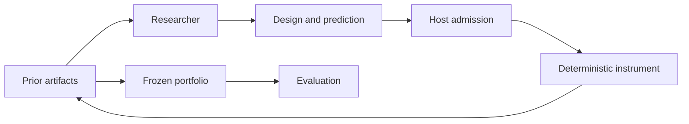

# algal-lab

Reproducible research environments built on [ALGAL](https://github.com/hraness/algal).

Researchers propose experiments, record predictions before measurement (the
ordering is enforced inside the local receipt; it is not an external
commitment), and build on prior artifacts within a study. The laboratory records
what was requested, what the instrument did, and which observations support each
result. Within a study, later rounds see up to 24 recent prior designs with
their discovery scores (graph, score, and evidence ID only) and, in one
condition, the last 12 short messages; hypotheses, rationales, predictions, and
trajectories are not shown to researchers, and nothing carries across studies.
Every competing design stays in the archive for inspection.

The first lab explores **network resilience**: which connected graph structures
preserve service as nodes fail? It compares isolated researchers, researchers
sharing artifacts, and researchers sharing artifacts plus messages. Every
condition gets the same number of proposal slots and paired failure schedules.

The [weighted-tree research](docs/weighted-tree-discovery.md) adds proved
optimal-design cases, exact counterexamples, and a bounded experiment evolving
reusable proposal policies. Its mathematical proofs, exhaustive numerical
certificates, and measured search results support different claims; none is a
claim of literature priority or broad LLM superiority.

## Try it

Tested with [Bun 1.3.14](https://bun.sh) (CI-pinned; `engines` requires
`>=1.3.14`). No credentials or model calls are needed.

```sh
git clone https://github.com/hraness/algal-lab.git
cd algal-lab
bun install --frozen-lockfile
bun run demo
bun run lab verify runs/demo
```

The demo runs 54 proposal slots: two seeds × three conditions × three researchers
× three rounds. Open `runs/demo/report.md` for the comparison. `study.json` links
the content-addressed evidence, full ALGAL receipts, frozen portfolios, and
per-design evaluation trajectories.

The default researcher is a **deterministic search baseline**. It uses observed
graphs and measurements and ignores message prose; the two shared conditions
therefore produce the same numerical baseline. This demonstrates the research
and verification machinery, not an LLM discovery or a benefit from communication.

Each run requires a new output directory. To change the protocol or rerun:

```sh
bun run lab study --protocol examples/network-study.json --out runs/experiment-2
bun run lab verify runs/experiment-2
```

## The research loop



- **Predictions precede measurements.** A proposal includes a graph, hypothesis,
  numerical prediction, rationale, and references to visible earlier experiments.
- **Information sharing is controlled.** Each round uses a fixed snapshot;
  later participants cannot see results from earlier participants in that round.
- **Evaluation is separated.** All portfolios freeze before evaluation on
  held-out random schedules and a repeated targeted-failure control. No subsequent
  model calls or holdout-based admission occur in the study.
- **Evidence is inspectable.** Failed attempts and original proposals remain in
  receipt-bearing artifacts. Bounded structural rejections become recorded errors.
- **Verification is offline.** It reconstructs the protocol with recorded agent
  effects, executes the simulator afresh, and checks the resulting receipts,
  artifacts, and the `study.json` report object against the archive.
  `report.md` is generated text and is not verified. Verification never runs
  the original provider command.

The instrument measures the largest surviving connected component divided by the
original node count, across random and targeted node-removal trajectories
(`network.v1`). A second instrument (`network.v2`, `src/heterogeneous.ts`)
gives each node a failure weight and value: random failure removes survivors
with probability proportional to weight, and service is the most valuable
surviving component's share of total value under a seeded per-replicate
environment. The v2 oracle is an exact subset dynamic program over
removal-set probabilities, bounded to ten nodes. This is a toy graph model.
It does not simulate traffic, physical materials, or actual infrastructure.
Two demo seeds are not evidence of statistical superiority.

## Connect a model

Supply an explicitly chosen, trusted command wrapper. It receives one ALGAL
`EffectRequest` JSON on stdin; the lab context is at `context.inputs.context`.
It must return one proposal JSON on stdout. The wrapper owns provider credentials
and model settings; credentials must never appear in its response. The wrapper
must also be stateless across calls: each proposal must depend only on the
request it receives. A wrapper that keeps memory (a cache, a conversation, a
file) would leak information across conditions and across researchers within a
round's fixed snapshot, and the lab cannot detect that leak.

Exercise that wire protocol with the included credential-free example:

```sh
bun run lab study --protocol examples/network-study.json --out runs/command-demo \
  --executor-command 'bun examples/scripted-executor.ts'
bun run lab verify runs/command-demo
```

Replace the example with your provider wrapper to use an LLM. The example is still
scripted search. A study allows at most 288 proposal slots; each receives at most
one agent call, 120 seconds, 64 KiB of context, and 8 KiB of output. These are
execution limits, not a dollar-spend guarantee. A provider failure consumes its
slot and is recorded without an automatic retry. Partial runs are retained; this
version does not resume them.

See the [proposal contract](src/contracts.ts), [researcher manifest](src/researcher.ts),
and [security boundary](SECURITY.md) before connecting an executor.

## Qualify the approach

The [frozen qualification plan](docs/qualification-plan.md) separates numerical
correctness from search usefulness. Its independent oracle computes expected
random-failure AUC over every removed-node subset on graphs with at most ten
nodes. It evaluates the full failure distribution, including discovery states.
Each condition selects one champion from discovery results before evaluation;
targeted attack remains a separately reported control. Researcher requests omit
condition names, while the host archive retains assignment metadata.

```sh
bun run qualify:instrument
bun run qualify
bun run lab verify-qualification runs/qualification
```

The instrument check covers every connected labeled graph with 4–6 nodes,
comparing the simulator against an independent union-find connectivity
implementation under every targeted horizon and five random schedules each.
It checks that random removals are valid and numerically consistent; the random
schedule's PRNG sequence itself is not independently derived. `bun run
qualify:instrument` finishes in a few seconds and writes
`runs/instrument-qualification.json`; that file is never overwritten, so pass a
new path to `bun scripts/qualify-instrument.ts <file>` for another run, or omit
the path to print the evidence to stdout.

The qualification runs three graph regimes and 16 search seeds against
equal-opportunity random search, preserving all paired differences and checking
that the scripted controls ignore message prose. Expect roughly 20–40 s for
`bun run qualify` and about half a minute for `verify-qualification` on a
recent laptop; `bun run check` takes one to two minutes on an idle machine and
longer when other work is running.
Read `runs/qualification/report.md`. Qualification needs a fresh directory;
use `bun run lab qualify --plan examples/qualification-plan.json --out runs/qualification-2`
for another run. A null sharing result is a valid outcome.

The replicated comparison is the next, frozen step:

```sh
bun run compare
bun run lab verify-comparison runs/comparison
```

`compare` runs the [frozen comparison plan](docs/comparison-plan.md)
(`examples/comparison-plan.json`):
the scripted control arms `adaptive` and `random`, an optional live arm when
`--executor-command` is supplied, and paired inference over replicate seeds
against a preregistered margin. `verify-comparison` reconstructs every arm's
studies offline and recomputes the whole analysis. Without a live arm the result
is a scripted control run, not model evidence.

```sh
bun run compare:v2
bun run lab verify-comparison runs/comparison-v2
```

`compare:v2` runs the [network.v2 plan](docs/comparison-plan-v2.md)
(`examples/comparison-plan-v2.json`), where each replicate poses a different
seeded environment and the endpoint is label-dependent by construction —
the regime the headroom study showed has real headroom for a live arm. The
first live run uses the pinned Gateway executor through
`examples/gateway-compare.ts` with the same plan and a 240-call budget.

The random-search policy is also available for individual studies:

```sh
bun run lab study --protocol examples/network-study.json --out runs/random --policy random
```

The optional [XCB example](examples/xcb-study.ts) uses qualified, ephemeral,
tool-free application inference and retains readable transport metadata. It
requires an independently admitted local provider; the default workflows never
make model calls. See [live executor qualification](docs/live-executor.md).

The [Gateway example](examples/gateway-study.ts) instead reuses ALGAL's built-in
Vercel AI Gateway executor. It requires explicit model/provider selection and
authorized Gateway credentials, retains token usage when reported, and uses the
same twelve-slot smoke acceptance. See [Gateway inference](docs/gateway-executor.md)
and its [frozen transport plan](docs/gateway-smoke-plan.md).
Two live smokes are recorded. The [first](docs/gateway-smoke-findings.md)
failed its predeclared acceptance: all twelve generations completed, but one
proposal exceeded the edge budget and remains retained as a failed slot. After
the [exact-budget v2 proposal contract](docs/proposal-contract-v2-plan.md) was
frozen, the [second smoke](docs/gateway-smoke-v2-findings.md) measured 12/12
proposals and passed. Neither smoke shows a sharing benefit: every condition
selected the same champion graph in both runs.

## Scope and development

The [terminal-tree result](docs/terminal-tree-discovery.md) gives a proved
frontier construction for optimal trees when two vertices survive, an exact
integer-rate solver, and a sampled optimizer with a finite-sample regret
certificate. Its endpoint is separate from trajectory AUC; the frozen
comparison, independent checks, and prior-art limits are retained.

The [ordered-survival result](docs/ordered-survival-discovery.md) proves an
additive four-point inequality at every failure horizon. Sorting alone gives
optimal equal-value cooperative or redundant pairs. Its bounded Qwen3-14B pilot
measures conjecture selection against a zero-model enumeration control; it
does not establish a model discovery advantage or literature-first priority.

The [rank-selection and groups note](docs/rank-selection-and-triples.md)
extends the pairing theorem beyond exponential clocks and proves strong
hardness for exact majority-triple optimization after two failures. A quadratic
regret bound explains why nearly equal rates still admit easy approximations.
The [stochastic-order group theorem](docs/stochastic-intact-groups.md) proves
that consecutive equal-size groups maximize every tail probability of intact
group count at every fixed survivor count, for independent atomless clocks
ordered by ordinary stochastic dominance. A bounded histogram optimizer
constructs the groups without evaluating inclusion probabilities. This removes the hazard-order assumption
from the [earlier group proof](docs/intact-groups-all-horizons.md).
An [exact finite certificate](docs/block-separated-triples.md) extends this
to three triples whose CDFs may cross within each target group. A separate
[robust approximation](docs/robust-stochastic-groups.md) handles arbitrary
histogram CDFs with explicit count and tail regret bounds, using established
isotonic regression and no joint-probability evaluations.
A [mixture-family theorem](docs/mixture-rank-grouping.md) gives another exact
rule: when all independent score laws mix the same two distributions, sort
their mixture weights and group consecutively. The bases may cross, so this
covers families with no stochastic ordering at all. Its histogram optimizer
checks affine collinearity exactly and evaluates no joint probabilities.
The proof uses an established squared-CDF discrepancy; priority of the
rank-grouping application remains unresolved.

The [hazard-mixture counterexample](docs/hazard-mixture-counterexample.md)
gives an exact negative answer to a higher-dimensional extension posed in a
2022 paper, and contradicts a specified theorem in a 2026 accepted manuscript.
It proves a unique hazard crossing in every dimension above two, supplies a
variant with strict weights and distinct rates, and explains why a shared slow
component can destroy hazard ordering. Priority and final-version checks are
recorded separately from the proof.

The [softmax spread theorem](docs/sharp-softmax-spread.md) gives an exact
repair: in dimension `n≥3`, the softmax-weighted mean has the expected Schur
ordering precisely when absolute temperature times input spread is at most `c_n`,
where `(n−2)(c_n−2) exp(c_n)=4`. The proof includes the boundary and explicit
counterexamples above it. An exact example also contradicts the unrestricted
property in a specified ICLR 2026 author PDF. The two-variable case and a
dimension-free sufficient bound follow from prior mean inequalities;
priority of the sharp dimension-dependent threshold remains unresolved.

On a [fixed-total nonnegative simplex](docs/simplex-softmax-order.md), the
sharp cutoff differs by temperature sign: positive temperature allows
`|τ|S≤d_n`, with `(d_n−2) exp(d_n)=2(n−1)`, while negative temperature
allows `|τ|S≤2c_n`. Both boundaries are strict modulo permutations.
Exact root certificates locate a reversal in which sign allows the larger
range at dimension 58. The classification is proved; its priority is open.

For [nested softmax task allocation](docs/softmax-task-allocation.md), every
pure allocation with full budgets between complete concentration and complete
specialization beats both endpoints at every matched positive temperature.
This supplies a gain for every team size from three onward. An exact
three-agent example disproves an explicit conjecture
in the paper's June 2025 version, which was omitted from September 2025 onward;
the later lower-bound theorem remains valid. The note also proves the exact
optimum and all maximizers for positive inner and nonpositive outer temperature.
These are source-relative advances; first-discovery priority remains unresolved.

The [specialization boundary theorem](docs/softmax-specialization-boundaries.md)
solves the two-agent problem at every temperature pair, proving three is the
smallest dimension with positive matched-temperature gain even when arbitrary
continuous allocations can leave budget unused. Among pure full-budget
allocations, it proves that two balanced groups are optimal near zero and,
for square populations, square-root-sized groups are optimal at sufficiently
large temperature. Nine agents therefore exhibit a proved change in optimal
group count; the transition temperature and broader priority remain open.

The [continuous-allocation sequel](docs/softmax-integral-optima.md) records the
first sufficient purity region and its full-budget lemmas. The later
[universal purity theorem](docs/softmax-universal-purity.md) extends that
result to every finite positive temperature pair and every finite population
and task count. Consequently both asymptotic grouping results become global
continuous optima, and the three-agent square phase classification holds at
every positive temperature pair.
Standard derivative and comparison ingredients are credited; broader
originality remains open.

The [certified occupancy solver](docs/certified-softmax-partitions.md) applies
classical fractional optimization after this reduction. Exact rational
exponential enclosures give a returned grouping an explicit additive regret
bound. A fixed study certifies a three-group intermediate regime for 16
agents and continuous regret below `10^-8` for tested 64-agent instances.
The current v3 endpoint reports continuous scope from the universal theorem;
older v1/v2 receipts retain their historical pure-only labels where recorded.

The [support-structure theorem](docs/softmax-support-structure.md) bounds
every positive-temperature optimum by a forest with at most `2N−1` active
tasks and `3N−2` positive entries. Two tasks are pure at all positive
temperatures, enabling a linear occupancy scan. Those support lemmas feed the
universal purity proof; the dimension threshold and feasible-reward tests are
retained as historical v2 evidence.

The [two-agent classification](docs/two-agent-softmax-phase.md) solves any
task count at positive temperatures: the optimum either concentrates the
agents or separates them, with one exact crossover. Two agents and three
tasks give an exact matched-temperature gain greater than `1/150`.
The [dominance theorem](docs/softmax-dominance.md) also settles three tasks
for any population. Solver v3 uses two candidate rewards for two agents
and a quadratic occupancy scan for three tasks, with rational regret
certificates. Pure and fractional rows occupy separate support components;
a task served by every agent forces complete concentration.

The [two-threshold certificate](docs/two-threshold-certificate.md)
characterizes quartet inequalities against arbitrary backgrounds, with an
exact linear scan for histogram clocks and counterexample witnesses. The
[context-reduction sequel](docs/rank-context-compression.md) permits dependent
focal scores and proves two backgrounds necessary even under strict stochastic
ordering with positive densities, through a general construction that hides a
local failure. The [minimum-context theorem](docs/minimal-rank-contexts.md)
extends preservation to arbitrary set rewards with an exact background bound. The
[short account](docs/discovery-story.md) explains the results; the
[novelty ledger](docs/novelty-ledger.md) records what prior art has actually
been checked and where priority remains unresolved.

ALGAL supplies typed execution and receipts. Algal Lab owns experimental
protocols, instruments, artifact retention, and interpretation. The dependency
is pinned to an exact public ALGAL source commit; this repository is distributed
as source, with no hosted service or npm publication required.

```sh
bun run check
```

Tests cover analytical graph cases, malformed proposals, information-sharing
boundaries, the command executor, archive tampering, offline reproduction, and
the maximum admitted study. Contribute through a checked pull request.

- [Research method](docs/research-method.md): measurements, controls, budgets, and limits.
- [Architecture](docs/architecture.md): ALGAL integration and the evidence model.
- [Roadmap and research sources](docs/roadmap.md): hypothesis testing, reusable
  discoveries, and later instrument evolution. Valhalla integration is deferred.
- [Contributing](CONTRIBUTING.md).
