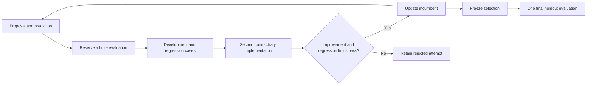

# Continue discovery on another machine

Algal Lab includes a resumable experiment loop and an [outer-agent skill](../.agents/skills/algal-discovery/SKILL.md). The command-line loop tests connected network designs, keeps an incumbent, retains failures, and checks a final selection on unused failure schedules. The skill extends that working pattern to proof development, literature comparison, independent review, and publication.

The network example is a software demonstration of a small connectivity model. It establishes neither a scientific discovery nor an improvement in a model's reasoning. The xAI and Gemini transports have been tested with local fixtures only. Live service behavior, model compatibility, pricing, and billing have not been qualified.

## Run without keys

Use the Bun version specified by `package.json` and the frozen lockfile. No global lab installation is needed.

```sh
git clone https://github.com/hraness/algal-lab.git
cd algal-lab
bun install --frozen-lockfile
mkdir -p runs
bun run discovery init --config examples/discovery-local.json --out runs/first-discovery
bun run discovery run runs/first-discovery --steps 4
bun run discovery status runs/first-discovery
bun run discovery run runs/first-discovery --steps 8
bun run discovery seal runs/first-discovery
bun run discovery confirm runs/first-discovery
```

The example makes at most 12 attempts, permits no model calls or spending, and reserves 15 seconds across its baseline, candidate evaluations, and final confirmation. Resuming uses the existing `state.json`; it does not repeat completed attempts. The run directory also holds the frozen config and small transition records. `runs/` is excluded from Git.

To supply a proposal through an outer agent, create a separate run and use:

```sh
bun run discovery context runs/first-discovery
bun run discovery propose runs/first-discovery --proposal examples/discovery-proposal.json --parent baseline
```

`propose` requires a run that has not been sealed. The parent must identify the baseline or a retained candidate. The JSON contains only a graph, prediction, hypothesis, and rationale. Unknown fields, disconnected graphs, duplicate edges, and changed node or edge counts are rejected. No candidate can name a command, executable, evaluator, URL, or API tool.

## What the loop checks

The fixed evaluator is `network.v1`. Its objective is average retained connectivity during random vertex removals, measured as the area under the service curve. The denominator remains the original node count. See the [research method](research-method.md) for the model and its limits.

Each candidate follows this sequence:



The simulator uses breadth-first search. A separate checker replays node-removal choices, uses disjoint sets for connectivity, and checks every trajectory value and the resulting score. This provides implementation cross-checking; a scientific interpretation still needs an independent reviewer.

Promotion requires a development score greater than the current incumbent by more than `minimumImprovement`. Neither the regression-schedule score nor the targeted-removal control may drop by more than `maxRegressionLoss` relative to that incumbent. Invalid, repeated, and worse proposals stay in the run with their original predictions and parents. The deterministic control performs one connected edge mutation per attempt. A frozen `strategy.id` and `strategy.instructions` describe the proposal policy; remote models receive those instructions as data alongside recent development results.

Holdout schedules are disjoint from development and regression schedules and never enter model prompts. `seal` permanently freezes the incumbent before `confirm` evaluates it and the original baseline. Confirmation does not choose another candidate or reopen search. An outer agent with filesystem access can read the config: separation is procedural and enforced by the runner API, not access isolation. The public example seeds are software fixture controls, not a defensible fresh research holdout. Once a holdout has informed a strategy change, treat it as development evidence and choose a new holdout for a later campaign.

## Budgets and recovery

Every config contains finite limits for attempts, time reservations, model calls, tokens, and dollars. Maximums also constrain nodes, edges, schedules, response bytes, concurrency, and proposals per request. Time is the sum of reserved operation limits, including requests issued in parallel; it is not a stopwatch for file I/O or time spent reading a report. Final confirmation time is reserved before any new attempt is allowed. Reservations are never refunded, including failed, abandoned, or interrupted work.

Initialization saves the baseline reservation before evaluating it. A failed or interrupted baseline leaves an inspectable run with no fabricated scores: `status` reports the outcome and full charge. That run cannot retry initialization or accept proposals. Preserve it in the campaign ledger; a new directory does not renew its allowance.

Model requests receive unique IDs and are saved before dispatch. Each response is saved as its request settles, before its proposal JSON is interpreted and without waiting for slower requests. `step` finishes interpreting captured responses before making a new request. A timeout or crash with no saved response leaves an unresolved request; another `step` stops rather than sending it again. This avoids duplicate requests but cannot determine whether an interrupted remote request was billed.

A truncated or otherwise unfinished reply retains its safe response ID, model, returned text, and reported token usage. Its proposals are not evaluated. It remains unresolved until explicitly abandoned, with the whole reservation charged. A reported token overage permanently stops further requests in that run, even when the reply was truncated; abandonment cannot clear it.

Inspect that record and provider-side history before abandoning an unresolved request:

```sh
bun run discovery status runs/first-discovery
bun run discovery abandon runs/first-discovery --request THE_RETAINED_REQUEST_ID
```

Abandonment consumes the original request and all its proposal slots. It never resends that ID. The synchronous adapters have no provider-side recovery endpoint or asynchronous batch protocol. A new call, if permitted by the remaining budget, gets a new ID. Excess reported token usage stops the run and cannot be cleared by abandonment.

One writer holds `.lock`. After a crash, `unlock` only releases a lock whose process is absent on the same host; it refuses a live owner or a lock copied from another host. Interrupted local evaluations remain failed, with their reservations charged. An interrupted final confirmation leaves selection sealed and cannot be repeated in that run.

Config, source, lockfile, and Bun identities are checked on resume. Keep the corresponding Git revision and Bun version with a run. A changed evaluator or strategy starts a new run; it cannot quietly change an old experiment. State hashes detect accidental modification, not forgery by someone who can rewrite local files.

For a machine handoff, finish the current command, verify there is no writer or unresolved remote request, and copy the selected run directory separately from the repository. Do not copy API keys or another process's live lock. Keep original research and publication allowances separate: creating a new software run does not renew an exhausted scientific budget.

## Optional xAI or Gemini proposals

Copy the local JSON into a private file under `runs/`, replace `provider` with the configuration below, select a model available to your account, and set explicit `budget.modelCalls`, `budget.tokens`, `budget.activeMs`, and `budget.usd` limits. Leave spending at zero until that allowance has been authorized.

```json
{
  "kind": "xai",
  "model": "YOUR_AVAILABLE_MODEL",
  "concurrency": 2,
  "proposalsPerCall": 2,
  "maxInputTokens": 32000,
  "maxOutputTokens": 2048,
  "timeoutMs": 30000,
  "reserveUsdPerCall": 0.10
}
```

For Gemini, set `kind` to `gemini` and choose a Gemini model name. Put `XAI_API_KEY` or `GEMINI_API_KEY` in your shell environment or secret manager, never in the config, shell history, repository, or run directory. Then initialize the new run and explicitly select live execution:

```sh
bun run discovery step runs/your-provider-run --live
```

The adapters use fixed HTTPS hosts, disable redirects and retries, send no tools, and bound the response stream. xAI uses Chat Completions; Gemini uses `generateContent`. The saved record includes requested and reported model identities when available, request and response IDs, returned candidate text, reported token usage, and the full reservation. Error bodies and authentication headers are not written to disk.

`proposalsPerCall` bundles independent candidates in one response; `concurrency` limits simultaneous requests to four. These are ordinary synchronous API calls, not provider batch jobs, and no batch discount is assumed. The full batch is reserved before the first dispatch; candidates are compared in request order using the same initial parent.

Input tokens are conservatively reserved from prompt bytes plus wrapper overhead. Output tokens use the configured limit, with reported Gemini thinking tokens counted too. A user-supplied dollar reservation is a local spending guard, not an authoritative invoice or a provider-enforced cap. Choose it from current model pricing, including reasoning tokens and other charges, and set account-level limits. Stop if usage or prices do not fit the reservation. Before relying on a live adapter, verify its current official API contract and run one separately authorized, small test; retain its actual model, usage, error, and recovery evidence.

## Improve the research method without losing the controls

Use `$algal-discovery` to drive finite campaigns. Keep a campaign record under `runs/` with the question, baseline strategy, candidate strategies and parent IDs, known failures, remaining allowance, and the next falsifiable test. Changing proposal instructions, retrieval, or decomposition creates a new strategy version. Compare it with the incumbent using matched tasks and budgets, then freeze it before fresh final evaluation. A favorable example alone does not establish strategy improvement.

The executable reference supports connected-graph proposals. Mathematical proof checking or another instrument requires a reviewed, fixed evaluator and its own controlled examples. The loop intentionally has no generated-code or arbitrary-shell evaluator hook. A proof assistant, SAT checker, exact arithmetic verifier, or manuscript build can be added as trusted repository code with explicit inputs and limits. Do not describe a heuristic graph score as evidence about the sumset, softmax, survival, or Ramsey results.

The outer agent keeps two separate questions for every scientific candidate:

1. **Is the claim supported?** Preserve assumptions, scope, proof or certificate, numerical reproduction, failed cases, and an independent review tied to the exact sources.
2. **What is new?** Identify primary sources, read the relevant theorem and proof, map assumptions and substitutions, compare the actual conclusion, follow citations in both directions, and record unresolved coverage. A failed query, abstract, model answer, or missing source cannot establish novelty.

The workflow draws on the retained-result and frozen-evaluation patterns in [Sponge](https://github.com/hraness/spongev2) and [Oh](https://github.com/hraness/oh), and the distinction between source reading and scientific reproduction in Hraness Bio. Their benchmark scores are not literature evidence for Algal Lab.

## Keep the public account current

Verified scientific results feed the repository's [`discoveries/`](../discoveries/) articles and manifest. Update the existing article when its result or evidence improves; use a new article for a distinct reader question. Preserve dated prior versions and immutable release identities. Performance changes to the research software belong in development notes unless they establish a separately supported result.

The skill requires an accessible introduction, the supported result and how it was obtained, a useful diagram when the evidence benefits from one, cited technical detail, and a final recap linking the resulting papers, proofs, or code. Citations include the relevant theorem or section and appear in the site's expandable references. Scope and priority statements must match the source comparisons. Articles carry a separate editorial review record and identify AI drafting and AI review accurately.

The outer agent runs the discovery exporter, both repositories' required checks, their normal pull-request and deployment workflows, and verifies the published URL and revision. The user's standing publication authorization covers those routine updates after the checks pass; a new human approval is not part of each cycle. The command-line experiment runner itself makes no commits, deployments, schedules, or publication requests.

Focused software validation:

```sh
bun test src/discovery/loop.test.ts
bun run typecheck
```

These tests exercise a credential-free example and mocked transports. They provide no live provider or scientific novelty qualification.
